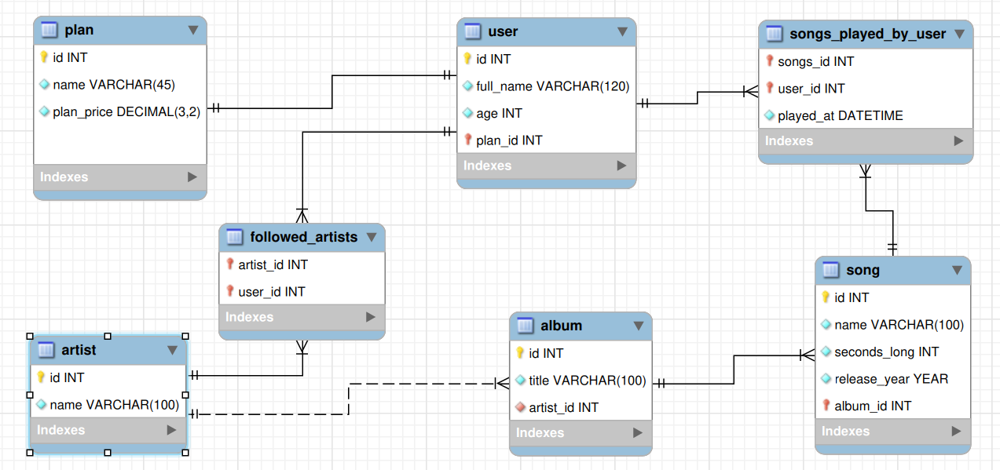

# dumbfy-db

## Why?

Small project from my initial MySQL studies. The objective was to model a database prototype that would be used by a music streaming service, in addition to creating some queries for it.

## How to run this bank on your computer?

1. Make sure you have [Docker](https://docs.docker.com/engine/install/) installed and running on your machine.

2. In the terminal, ensuring nothing is listening on port 3306, run the following command:

```bash
docker run -p 3306:3306 --name dumbfy -d emersonfbarros/dumbfy-db:latest
```

Alternatively, you can build the Docker image locally on your machine and then run it.

In the terminal, being at the root of this repository, execute the commands:

```bash
docker build -t dumbfy-db .

docker run -p 3306:3306 --name dumbfy -d dumbfy-db:latest
```

4. Access the DB through your favorite SQL client through **localhost:3306** using the password **dumbpassword**.

5. Take a look at this repository's queries directory and run some of them to see the database in action.

## Check out the dumbfy-db EER diagram


